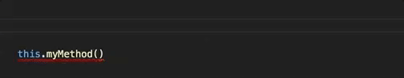

# Excercise: Implement SignatureHelp

To get started, please checkout the branch called `Excercise_02`.

It's time for the first LSP specific feature implementation: 

## Signature Help

Signature Help is usually represented as a hover that pops up in the context of a function call. It should provide information about the available arguments and if supported by the different overloads. It can shows what parameters exist, whether they are optional and what there default values are. Also it marks the currently active parameter.
Here is an example of it in action:

Our language allows to call symbols defined elsewhere. Those definitions may define parameters. We need to validate any defintion refreence to provide the correct number of arguments.



## Signature Help for Calculator DSL

In our DSL we have simple function calls, without overloads or default values. The excercise is to implement the `ISignatureHelpService`specifically for the Calculator DSL, such that it guides the user when providing arguments.

# Solution

# Step 1 : Class creation and binding

Within the `org.xtext.calc.ide` project, create a new class `SignatureHelpService` and bind it in the `DefaultIdeModule`.

```{xtend}
class SignatureHelpService implements ISignatureHelpService {

	override SignatureHelp getSignatureHelp(XtextResource resource, int offset) {
		// implementation goes here
		return EMPTY
	}
}
```

In the `DefaultIdeModule` :
```{xtend}
class DefaultIdeModule extends AbstractGenericModule {
	
	def void configureExecutorService(Binder binder) {
		binder.bind(ExecutorService).toProvider(ExecutorServiceProvider)
	}
	
}
```

## Step 2 : Writing a test

Again it makes sense to write a test first, so we know what we want to achieve and have a setup that allows us to debug the implmentation with fast turn arounds.

Xtext provides a very convenient base class to test language server functionality, which we will use here.

```{xtend}
import org.eclipse.xtext.testing.AbstractLanguageServerTest
import org.junit.Test

import static org.junit.Assert.*

class SignatureHelpServiceTest extends AbstractLanguageServerTest {
	
	new() {
		super("calc")
	}
	
	@Test def void testSignatureHelp() {
		testSignatureHelp [
			column = 7
			line = 2
			it.model = '''
				let myFunc(a,b,c) : 42
				
				myFunc(1, 3, 5)
			'''
			assertSignatureHelp = [ help |
				assertEquals('myFunc(a,b,c)', help.signatures.head.label)
				assertEquals(0, help.activeParameter)
			]
		]
	}
}
```

If you run the test now, it should fail. So let's see what we can do to make it succeed.

## Step 3 : Implement the SignatureHelpService

The SignatureHelp will be called, whenever the user types a '(' or ','. This information is part of the default server capabilities that are exchanged when the language server is initialized.

For our implementation we need to detect
 - the feature call we are in
 - what argument is active (i.e. the cursor position in the argument list)

 To get an AST element for an offset we go through Xtext's node model. A useful utility is the class `NodeModelUtils`.

Another approach is to go over the parseResult of the provided `XtextResource`, e.g. you get access to the root node, that contains and spans all other parse nodes with this code `resource.parseResult.rootNode`.

On a node you can ask for shildren, for leafnodes, for actual offets and lengths as well as obtain the associated semantic element (aka AST object).


## !!!! Solution

```{xtend}
import com.google.inject.Singleton
import org.eclipse.lsp4j.ParameterInformation
import org.eclipse.lsp4j.SignatureHelp
import org.eclipse.lsp4j.SignatureInformation
import org.eclipse.xtext.ide.server.signatureHelp.ISignatureHelpService
import org.eclipse.xtext.nodemodel.util.NodeModelUtils
import org.eclipse.xtext.resource.XtextResource
import org.xtext.calc.webCalc.Definition
import org.xtext.calc.webCalc.FeatureCall

import static com.google.common.collect.Lists.newArrayList

import static extension org.eclipse.xtext.nodemodel.util.NodeModelUtils.getNode

/**
 * Implements signature help for the feature calls in the calculator DSL.
 */
@Singleton class SignatureHelpService implements ISignatureHelpService {
	
	override getSignatureHelp(XtextResource resource, int offset) {
		val nodesBeforeOffset = resource.parseResult.rootNode.leafNodes.takeWhile[it.offset<offset];
		val lastOpening = nodesBeforeOffset.findLast[text=='(']
		val lastClosing = nodesBeforeOffset.findLast[text==')']
		if (lastOpening === null) {
			return EMPTY
		}
		if (lastClosing !== null && lastOpening.offset < lastClosing.offset) {
			return EMPTY
		}
		switch element : NodeModelUtils.findActualSemanticObjectFor(lastOpening) {
			FeatureCall case element.feature instanceof Definition : 				
				return getSignatureHelp(element, element.feature as Definition, offset)
			default : 
				return EMPTY
		}
	}

	private def SignatureHelp getSignatureHelp(FeatureCall featureCall, Definition definition, int offset) {
		val separators = newArrayList
		var activeParameter = 0
		for (node : featureCall.node.children) {
			if (node.text == '(' && node.offset >= offset) {
				return EMPTY
			} else if (node.text == ')' && node.offset < offset) {
				return EMPTY
			} else if (node.text == ',') {
				separators.add(node)
				if (node.offset < offset) {
					activeParameter++
				}
			}
		}
		val parameters = definition.params.map [
			new ParameterInformation(name, null)
		]
		return new SignatureHelp(#[
				new SignatureInformation(
					'''«definition.name»(«definition.params.map[name].join(',')»)'''
					, null
					, parameters)
			], 0, activeParameter)
	}
	
}

```