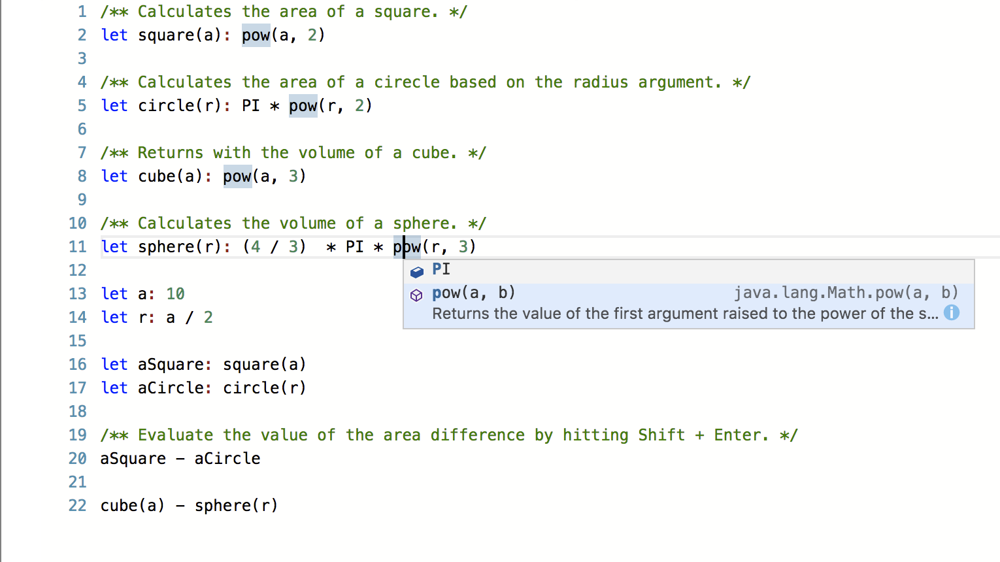

# Tutorial: Building a Language Server for your DSL using Xtext

In this tutorial you will learn how to create a language server for any Xtext DSL. For this example we use a simple language, that allows to do arithmetics with numbers and define and reuse functions. Here is the example script that we will use throughout the tutorial:

You can find a working online demo of this here : http://monaco-demo.typefox.io/
