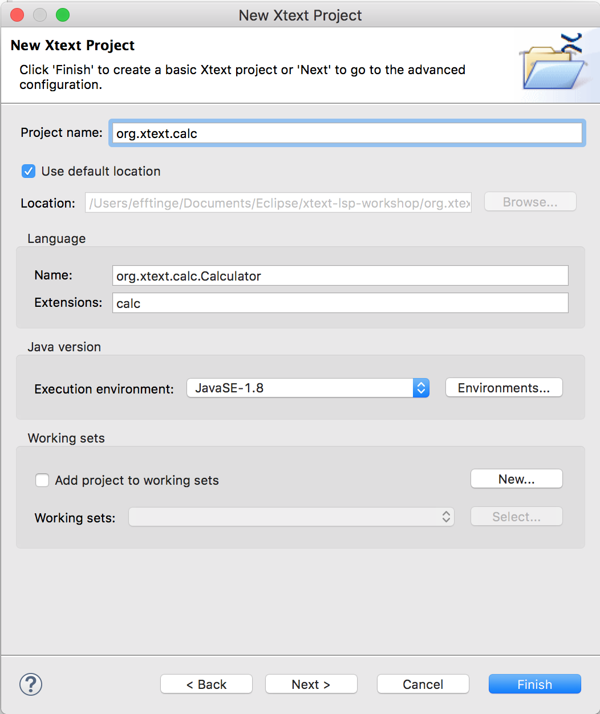
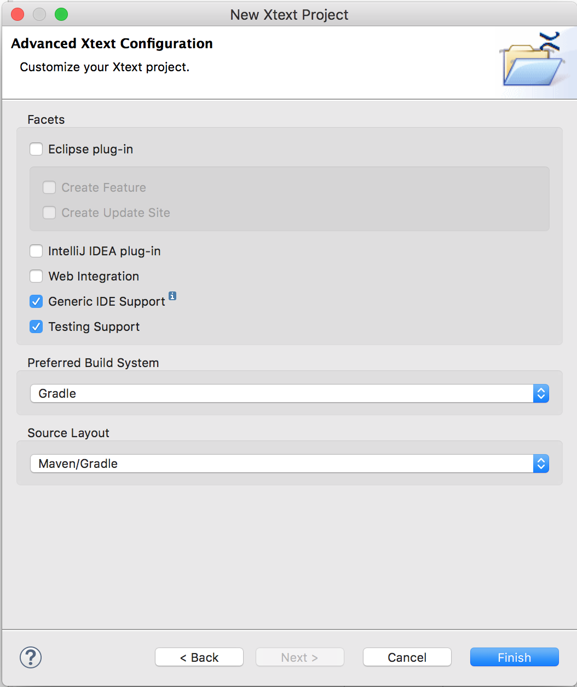

# Environment and Project setup

To start with the tutorial, you'll need a fresh Eclipse Oxygen with the latest Xtext 2.12 release installed.
Also at least Java 8 JDK is required to be installed on you machine.

## Prerequisites / Install Eclipse

You can download the Eclipse distribution from here : 
   https://www.eclipse.org/downloads/index-developer.php (before the oxygen release)

If you pick the "Eclipse IDE for Java and DSL Developers" you should be all set, otherwise please install "Xtext SDK" from the oxygen update-site.

## Creating the projects

Creating the set of projects (or modules) for your Xtext Language Server is very easy, as it is supported by the Eclipse Wizard.
From the main menu please choose _File -> New -> Project..._. In the opened dialog you need to select _Xtext Project_ and click _Next_.

Next up we need to give the project as well as our language a name. In addition the file extension for our language needs to be specified. IF you don't want to get out of sync with the tutorial, you should provide the following values:



On the next page, you can configure your project. We don't want an Eclipse plug-in, nor native support for intellij or web, as we are going to implement the LSP. Also we want to use Gradle as the build system and the maven/gradle source layout.



## The projects

After clicking _Finish_ on the last wizard page, Eclipse will create three projects for you:

### org.xtext.calc

Here you will find the grammar and other core language constructs, that are needed for any kind of language usage. Some common examples of functionality you will find here are:

  - lexer, parser 
  - AST types
  - linker
  - validation
  - generator
  - interpreter

### org.xtext.calc.ide

This project contains tool specific features, that you don't usually need when using a language implementation at runtime, e.g. to execute and interpreter. But only if you use it to support an editor. Examples of functionality that should go here is:
  - content assist
  - hover
  - method signature helper

You don't necessarily need to split the two project, but could lump them together if you feel two projects are too much for this. But the wizard creates it like that by default.

### org.xtext.calc.parent

The parent project for the other two modules explained above.

## Define the grammar

The wozard should have opened the grammar file for you already. From the start it contains a tiny hello-world-example, that we now want to replace with our calculation DSL.

For this tutorial we don't want to go into too detail about how the Xtext grammar language works. If you want to learn more, please [check out the documentation](https://eclipse.org/Xtext/documentation/301_grammarlanguage.html).

```{xtext}
grammar org.xtext.calc.Calculator with org.eclipse.xtext.common.Terminals

generate webCalc "http://www.xtext.org/example/webcalc/WebCalc"

Calculation:
	statements+=Statement*;

Statement:
	Definition | Evaluation;

AbstractDefinition:
	Definition | DeclaredParameter;

Definition:
	native?='native' name=ID isFunction?='(' (params+=DeclaredParameter (',' params+=DeclaredParameter)*)? ')' |
	'let' name=ID (isFunction?='(' (params+=DeclaredParameter (',' params+=DeclaredParameter)*)? ')')? ':' expression=Expression;

DeclaredParameter:
	name=ID;

Evaluation:
	expression=Expression;

Expression:
	Addition;

Addition returns Expression:
	Multiplication ->({BinaryExpression.left=current} operator=('+' | '-') right=Multiplication)*;

Multiplication returns Expression:
	UnaryExpression ({BinaryExpression.left=current} operator=('*' | '/') right=UnaryExpression)*;

UnaryExpression returns Expression:
	({UnaryExpression} operator='-' expression=PrimaryExpression) |
	PrimaryExpression;

PrimaryExpression returns Expression:
	'(' Expression ')' |
	NumberLiteral |
	FeatureCall;
	
FeatureCall :
	feature=[AbstractDefinition] ->('(' (args+=Expression (',' args+=Expression)*)? ')')?;

NumberLiteral:
	value=Number;

Number:
	INT ('.' INT)?;
```

## Configure the Xtext generator

We also have changed the `mwe2` file a bit to fit our needs. Specifically we don't need a stub for the scope provider (we use the default scoping) and the generator (we will later implement an interpreter, instead).

Here are the relevant changes:

```
... 
        language = StandardLanguage {
			name = "org.xtext.calc.Calculator"
			fileExtensions = "calc"

			serializer = {
				generateStub = false
			}
			generator = {
				generateStub = false
			}
			scopeProvider = {
				generateStub = false
			}
			validator = {
				composedCheck = "org.eclipse.xtext.validation.NamesAreUniqueValidator"
			}
		}
...
```

## Generate the language infrastructure

Now we are all set to start the Xtext generator. To do so you can right click in either the `Calculator.xtext` or the `GenerateCalculator.mwe2` file and choose _Run As_->_Generate Xtext Artifacts_. Alternatively you can run the gradle build.

## Writing a first test

After code generation there might be a compile error in the generated test file `CalculatorParsingTest.xtend`. Let's replace the contents with the following to verify that we can at least parse our example without any errors:

```{xtend}
package org.xtext.calc.tests

import com.google.inject.Inject
import org.eclipse.xtext.testing.InjectWith
import org.eclipse.xtext.testing.XtextRunner
import org.eclipse.xtext.testing.util.ParseHelper
import org.junit.Assert
import org.junit.Test
import org.junit.runner.RunWith
import org.xtext.calc.webCalc.Calculation

@RunWith(XtextRunner)
@InjectWith(CalculatorInjectorProvider)
class CalculatorParsingTest {
	
	@Inject 	ParseHelper<Calculation> parseHelper
	
	@Test
	def void loadModel() {
		val result = parseHelper.parse('''
			/** Calculates the area of a square. */
			let square(a): pow(a, 2)
			
			/** Calculates the area of a cirecle based on the radius argument. */
			let circle(r): PI * pow(r, 2)
			
			/** Returns with the volume of a cube. */
			let cube(a): pow(a, 3) 
			
			/** Calculates the volume of a sphere. */
			let sphere(r): (4 / 3)  * PI * pow(r, 3)
			
			let a: 10
			let r: a / 2
			
			let aSquare: square(a)
			let aCircle: circle(r)
			
			/** Evaluate the value of the area difference by hitting Shift + Enter. */
			aSquare - aCircle
			
			cube(a) - sphere(r)
		''')
		Assert.assertNotNull(result)
		Assert.assertTrue(result.eResource.errors.isEmpty)
	}
}

```